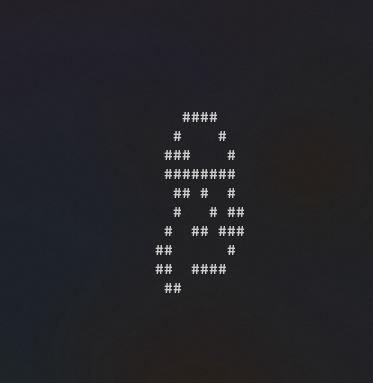

# Langston-Ant
Langston Ant travel algorithm implementation. 

> Langton's ant is a two-dimensional universal Turing machine with a very simple set of rules but complex emergent behavior. It was invented by Chris Langton in 1986 and runs on a square lattice of black and white cells. The universality of Langton's ant was proven in 2000. The idea has been generalized in several different ways, such as turmites which add more colors and more states. 

More info on [Wiki](https://en.wikipedia.org/wiki/Langton%27s_ant).

